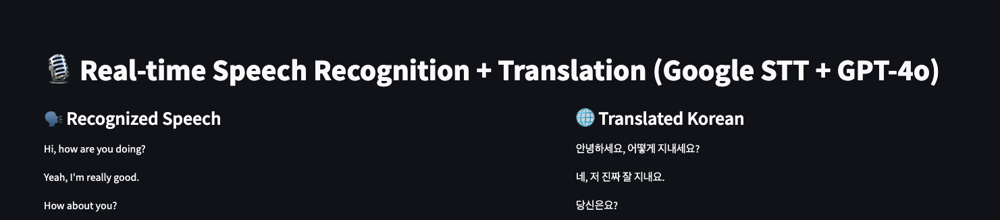

# 🎙️ Real-Time Voice Translator (Google STT + GPT-4o)

> **영어 음성을 실시간으로 인식하고 자연스러운 한국어로 번역해주는 Streamlit 기반 웹**  
> Real-time English speech recognition and translation into fluent Korean using Google STT + GPT-4o.



---

## 🚀 Features

- 🎧 Real-time **speech-to-text** using Google Cloud STT
- 🌐 **Live translation** into Korean using OpenAI GPT-4o
- 🧠 Supports **streaming audio input** via microphone
- 📦 Streamlit-based web interface for **instant feedback**
- 🛑 Automatically shuts down microphone on app close (safe resource management)

---

## 🛠️ Tech Stack

| Tool           | Description                            |
|----------------|----------------------------------------|
| `Google STT`   | Real-time speech recognition           |
| `OpenAI GPT-4o`| Natural Korean translation             |
| `Streamlit`    | Interactive front-end in Python        |
| `PyAudio`      | Microphone streaming input             |
| `AsyncIO`      | Asynchronous translation processing    |
| `dotenv`       | Environment variable management        |

---

## 🧑‍💻 Getting Started

### 1. Clone the repository

```bash
git clone https://github.com/your-username/real-time-voice-translator.git
cd real-time-voice-translator
```

### 2. Install dependencies (with virtual environment recommended)

```bash
python3 -m venv venv
source venv/bin/activate
pip install -r requirements.txt
```

If no `requirements.txt`, install manually:

```bash
pip install streamlit openai google-cloud-speech python-dotenv pyaudio
```

> 💡 On macOS, `pyaudio` may require `portaudio`:
> ```bash
> brew install portaudio
> pip install pyaudio
> ```

---

### 3. Setup environment variables

Create a `.env` file in the root directory:

```env
OPENAI_API_KEY=your_openai_api_key
GOOGLE_APPLICATION_CREDENTIALS=your_google_credentials.json
```

Make sure your credentials file is downloaded from GCP and NOT pushed to GitHub.

---

### 4. Run the app

```bash
streamlit run app.py
```

---

## 🎯 Example Output

| 🗣️ English Input     | 🌐 Korean Translation   |
|--------------------  |------------------------|
| How are you?         | 어떻게 지내세요?           |
| Thank you very much. | 정말 감사합니다.           |

---

## 📁 File Structure

```bash
.
├── app.py              # Main application
├── .env                # Environment variables 
├── README.md
└── requirements.txt    
```

---

## ✅ To-Do

- [ ] Speaker diarization (multi-speaker separation)
- [ ] Whisper-based backend option
- [ ] Gradio version
- [ ] Export to subtitles / transcript file

---

## 🛡️ License

MIT License © 2025 Superdragon Kim

---

## 🙌 Credits

- [Google Cloud STT](https://cloud.google.com/speech-to-text)
- [OpenAI GPT-4o](https://platform.openai.com/docs)
- [Streamlit](https://streamlit.io)

---

## 🌟 Star History

If you like this project, please consider giving it a ⭐️ on GitHub!

